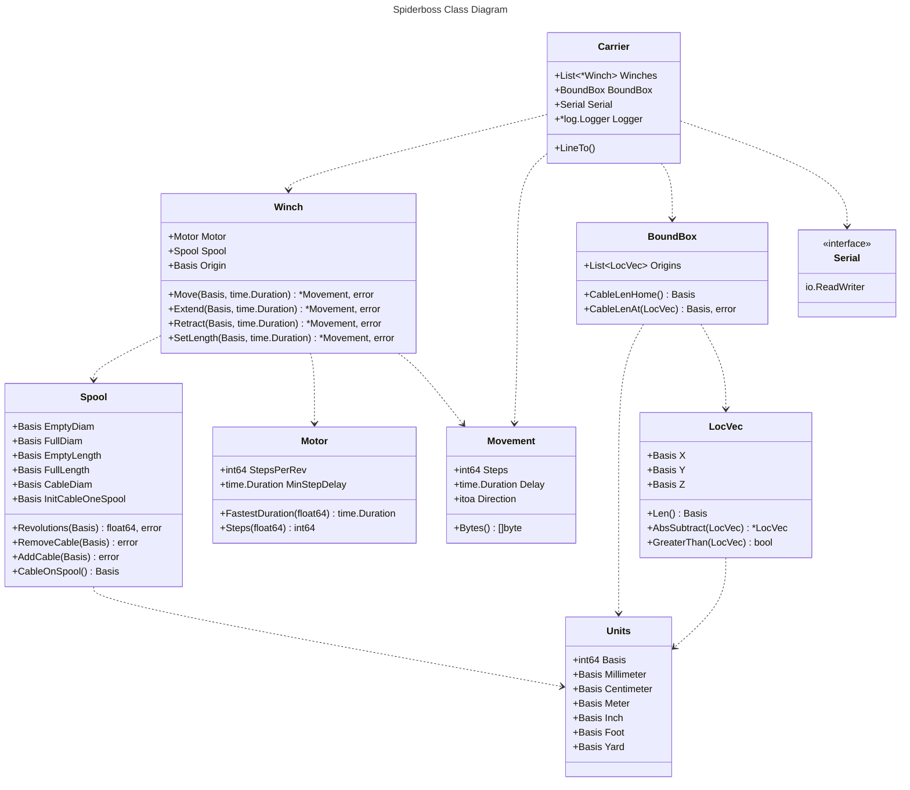

<picture>
 <source media="(prefers-color-scheme: dark)" srcset="assets/spiderboss_logo_dark.svg">
 <source media="(prefers-color-scheme: light)" srcset="assets/spiderboss_logo.svg">
 
</picture>

Spiderboss Lib
==============

## Overview
Spiderboss is a library for controlling cable-suspended platform. Think of the
NFL skycam, that is a cable-suspended camera.

As of now there aren't any specific target applications and this is just for-fun
project. This is still a WIP (work in progress).

## Concepts
The main parts are the bound box, the virtually modeled real-world measurements
of the cable system. The winches are a combination of a stepper motor and a
spool. Spools can be of arbitrary size, with arbitrary sized cable. The spool
mechanism will:
- calculate maximum length of cable the spool can hold
- adjust the revolutions required to extend a certain amount of cable based on
  the current diameter of the spool.

The main functionality of this library is to return the number of steps each
motor need to take to move the carrier in an Cartesian coordinate bound box and
the delay each motor needs to have in order to simultaneously finish their
steps.

## Architecture

## License
Apache License 2.0
